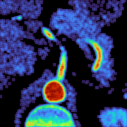

# NRRD

Nearly Raw Raster Data

### How to use

Get raster raw data from a given NRRD raw data file should be very simple:

```r
require(NRRD);

# open raw NRRD data file 
nrrd   = NRRD::nrrdRead("..\\data\\stent.nrrd");
# view of the file header data
header = as.list(NRRD::metadata(nrrd));
# and get raster data for image rendering
raster = NRRD::getRaster(nrrd);
```

#### Raster image rendering



```r
require(graphics2D);

# for a 2d image
bitmap(file = "./raster_image_heatmap.png", size = [1024,1024], fill ="black");
# draw heatmap
graphics2D::rasterHeatmap(raster, colorName = "viridis");
dev.off();

# for a specific layer from the 3d scan data
bitmap(file = `./stent/raster__${i}.png`, size = [256,256], fill ="black");
# draw heatmap
graphics2D::rasterHeatmap(
    x = raster → NRRD::getRasterLayer(i), 
    colorName = "viridis:turbo"
);
dev.off();
```

